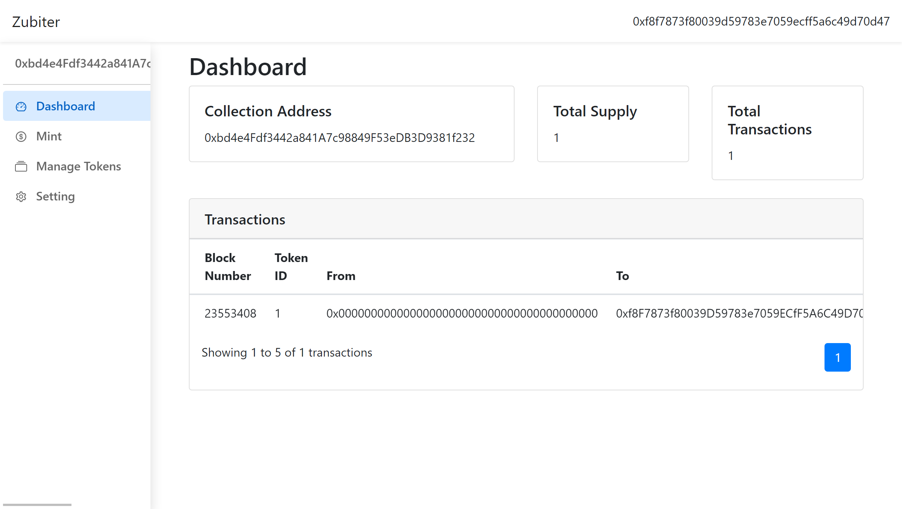

# Zubiter
https://zubiter-app.limaois.me/  
Create NFT collection and manage it without coding.

Associated Repo for contracts used: https://github.com/flyinglimao/zubiter-contract

## Contracts
### Binance Testnet
Zubiter Main: 0x208934f52B250705170Dda55baCD5Bc7Be71d8c2
Zubiter ClonableERC721: 0xC9446eE71249c30E4B3fD398E6D6Eb5d813552ED

### Binance Mainnet
Zubiter Main: 0x455B3e98cC41419C64CcDc7d852B0e2191a66134
Zubiter ClonableERC721: 0x33fe79A5c3c69c87BFE734fad3A44855def27B01
## Develop
This project used [Create React App](https://github.com/facebook/create-react-app).  

### `yarn start`

Runs the app in the development mode.\
Open [http://localhost:3000](http://localhost:3000) to view it in the browser.

The page will reload if you make edits.\
You will also see any lint errors in the console.
### `yarn build`

Builds the app for production to the `build` folder.\
It correctly bundles React in production mode and optimizes the build for the best performance.

The build is minified and the filenames include the hashes.\
Your app is ready to be deployed!

See the section about [deployment](https://facebook.github.io/create-react-app/docs/deployment) for more information.
